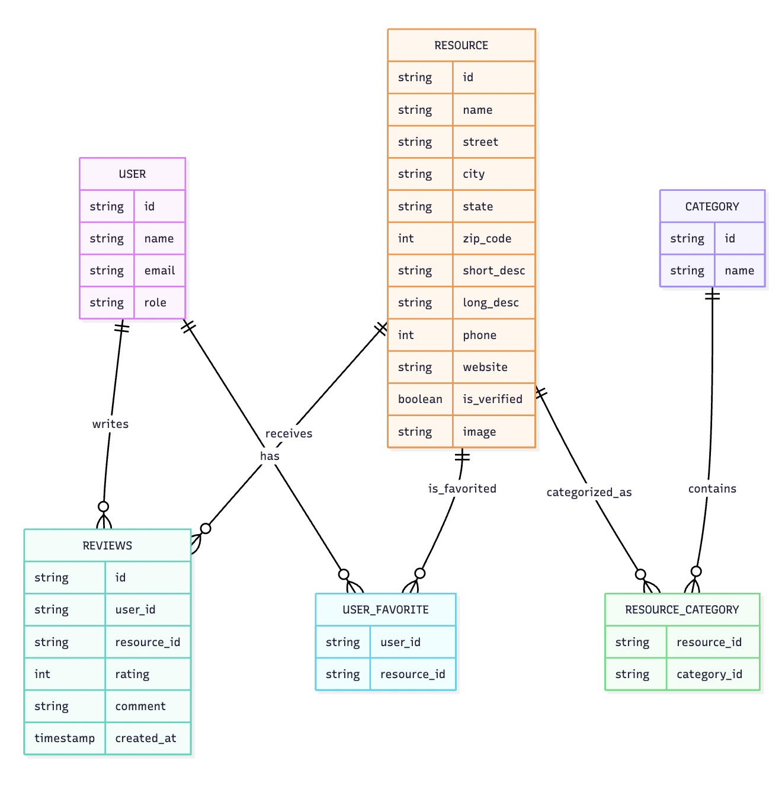

# Entity Relationship Diagram

Reference the Creating an Entity Relationship Diagram final project guide in the course portal for more information about how to complete this deliverable.

## Create the List of Tables

- Users
- Resources
- Categories
- Reviews
- UserFavorite
- ResourceCategory

## Add the Entity Relationship Diagram

